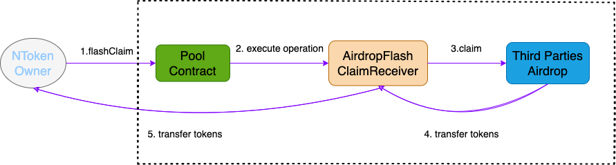
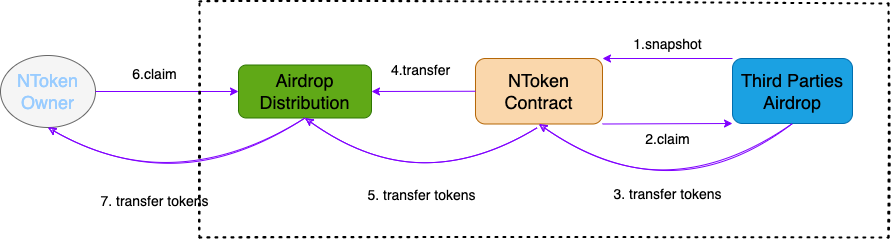

# Flash Claim

Flash Claim is similar to the well known Flash Loan. Through Flash Claim, you can use your collateralized NFT to claim third parties airdrop without repaying to lending pool.

For well-known airdrop projects, Omni will officially make adaptations. Users do not need to develop contract codes and understand the underlying technical details. They only need to select the airdrop project and their own NFT on the webpage to quickly complete the claim.

For those airdrop projects that have not officially supported, if you think it is good project, please give feedback in the Discord community. Omni will try to give priority to support if there is sufficient manpower and time.

Omni supports two types of airdrop projects, the first type is realtime balance type, which the user can claim the airdrop as long as he owns the NFT when the claiming transaction confirmed , the second type is snapshot balance type, which need user owns the NFT for the snapshot block height.

For the first type, Omni use Flash Claim to support user claim airdrop, the official implementation code of AirdropFlashClaimReceiver is on [Github](https://github.com/parallel-finance/omni-flashclaim/blob/main/contracts/AirdropFlashClaimReceiver.sol). User can register their own AirdropFlashClaimReceiver by calling UserFlashclaimRegistry Contract, the code is on [Github](https://github.com/parallel-finance/omni-flashclaim/blob/main/contracts/UserFlashclaimRegistry.sol). For advanced users, you can also write a contract to implement IFlashClaimReceiver.&#x20;

For the second type, Omni will claim airdrop first and then distribute tokens to user by AirdropDistribution Contract. If airdrop project party use some random algorithm to distribute tokens, for fairness and safety, we also use random algorithm which is based on [Chainlink VRF infrastructure](https://vrf.chain.link/mainnet) to distribute tokens.  If airdrop project party use a special distribution algorithm we don't support currently, we can also upgrade our airdrop distribution algorithm for user(AirdropDistribution Contract is deployed as an upgradeable way). The current implementation code for airdrop distribution is on [Github](https://github.com/parallel-finance/omni-flashclaim/blob/main/contracts/AirdropDistribution.sol).

