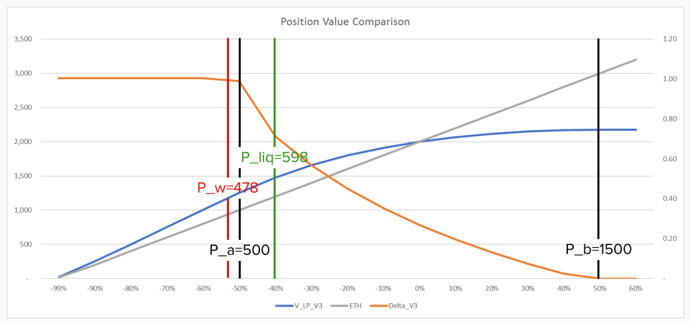
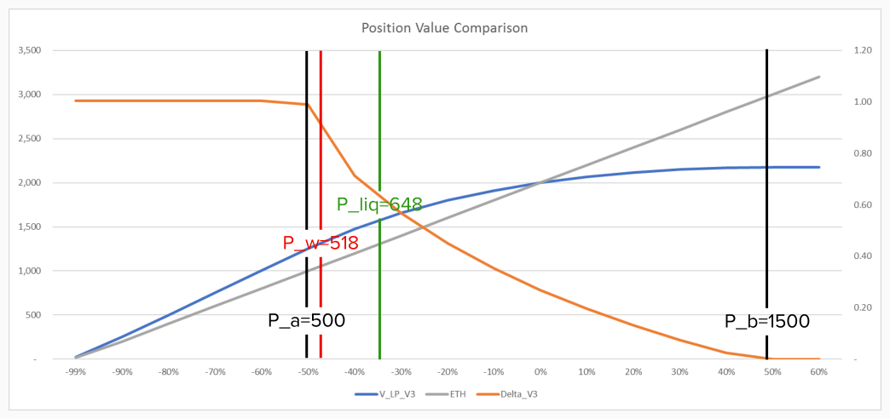

# Scenarios-Specific Exmaples

### **Scenario #1:** $$P_w < P_{liq} \le P_a$$​

ETH is at $1000. User provides liquidity of 1 ETH plus 1596.12 USDT within $500-1500 price range. The LP position is worth $2596.12, and user used the LP collateral and borrowed 40% of collateral value, i.e. 1038.45 USDT. Furthermore, OMNI sets ETH liquidation threshold is 80%.

1. $$P_w$$ is calibrated to $318.81 per eq. (2), (3) and (4) in [liquidation threshold calibration](https://app.gitbook.com/s/1zxoDFxnekcVHCBzqumN/\~/changes/XOMxzM9HoTdqEUipik2u/ethereum-network/uniswap-v3-lp-token-as-collateral/liquidation-threshold-calibration-of-lp-tokens) page.
2. $${P\_{liq}}={318.81}*\frac{100\%-80\%}{80\%}=\$398.51$$per eq. (5) in [liquidation threshold calibration](https://app.gitbook.com/s/1zxoDFxnekcVHCBzqumN/\~/changes/XOMxzM9HoTdqEUipik2u/ethereum-network/uniswap-v3-lp-token-as-collateral/liquidation-threshold-calibration-of-lp-tokens) page.
3. Liquidation threshold for the LP position is calculated as $$\frac{V(P_w)}{V(P_{liq})}=\frac{1038.45}{1298.06}=80\%.$$

.png>)

Note in this case the liquidation threshold for the LP position is the same as that of ETH. This is due to the fact that the liquidation price ($$P_{liq}$$) is below the lower bound of the liquidity provision range, thus the LP position is composed 100% by ETH and 0% USDT around the neighborhood of the liquidation price. This means the LP position is essentially just a wrap for a number of ETH when ETH drops to the liquidation price, such that the LP position has exactly the same risk profile as ETH, i.e. Delta of the LP position is constant at 1 as shown in the orange line between the red and green vertical lines.

### **Scenario #2:** $$P_w \le P_a < P_{liq}\le P_b$$

ETH is at $1000. User provides liquidity of 1 ETH plus 1596.12 USDT within $500-1500 price range. The LP position is worth $2596.12, and user used the LP collateral and borrowed 60% of collateral value, i.e. 1557.67 USDT. Furthermore, OMNI sets ETH liquidation threshold is 70%.

1. $$P_w$$ is calibrated to $478.22 per eq. (2), (3) and (4) in [liquidation threshold calibration](https://app.gitbook.com/s/1zxoDFxnekcVHCBzqumN/\~/changes/XOMxzM9HoTdqEUipik2u/ethereum-network/uniswap-v3-lp-token-as-collateral/liquidation-threshold-calibration-of-lp-tokens) page.
2. $${P\_{liq}}={478.22}*\frac{100\%-80\%}{80\%}=\$597.77$$ per eq. (5) in [liquidation threshold calibration](https://app.gitbook.com/s/1zxoDFxnekcVHCBzqumN/\~/changes/XOMxzM9HoTdqEUipik2u/ethereum-network/uniswap-v3-lp-token-as-collateral/liquidation-threshold-calibration-of-lp-tokens) page.
3. Liquidation threshold for the LP position is calculated as $$\frac{V(P_w)}{V(P_{liq})}=\frac{1557.67}{1913.47}=81.41\%.$$

Here we see the liquidation threshold for the LP position is slightly higher than that of ETH, amid the higher value stability. The excess liquidation threshold ($$81.41\%-80\%=1.41\%$$) is small due to the fact that liquidation price is very much approaching the lower bound of liquidity provision, so the LP position is already predominantly composed of ETH (i.e. 81.19% of the LP position value is contributed by ETH to be exact).

### ****

### **Scenario #3:** $$P_a<P_w <P_{liq}< P_b$$

ETH is at $1000. User provides liquidity of 1 ETH plus 1596.12 USDT within $500-1500 price range.  The LP position is worth $2596.12, and user used the LP collateral and borrowed 60% of collateral value, i.e. 1687.48 USDT. Furthermore, OMNI sets ETH liquidation threshold is 80%.

1. $$P_w$$ is calibrated to $518.46 per eq. (2), (3) and (4) in [liquidation threshold calibration](https://app.gitbook.com/s/1zxoDFxnekcVHCBzqumN/\~/changes/XOMxzM9HoTdqEUipik2u/ethereum-network/uniswap-v3-lp-token-as-collateral/liquidation-threshold-calibration-of-lp-tokens) page.
2. $${P\_{liq}}={518.46}*\frac{100\%-80\%}{80\%}=\$648.08$$ per eq. (5) in [liquidation threshold calibration](https://app.gitbook.com/s/1zxoDFxnekcVHCBzqumN/\~/changes/XOMxzM9HoTdqEUipik2u/ethereum-network/uniswap-v3-lp-token-as-collateral/liquidation-threshold-calibration-of-lp-tokens) page.
3. Liquidation threshold for the LP position is calculated as $$\frac{V(P_w)}{V(P_{liq})}=\frac{1687.48}{2037.05}=82.84\%.$$

Again, this is a similar scenario to Scenario 2, where we arrive at higher liquidation threshold for the LP position amid its higher price stability. The increase in the liquidation threshold from Scenario 2 is contributed to overall lower level of Delta of the LP position when the range defined by the red and green vertical line moves to the right.

As noted in the [liquidation threshold calibration ](https://app.gitbook.com/s/1zxoDFxnekcVHCBzqumN/\~/changes/XOMxzM9HoTdqEUipik2u/ethereum-network/uniswap-v3-lp-token-as-collateral/liquidation-threshold-calibration-of-lp-tokens)page, loans will not be granted if the calibrated liquidation price is above the upper bound of liquidity provision range. Thus, no other scenarios are applicable.
